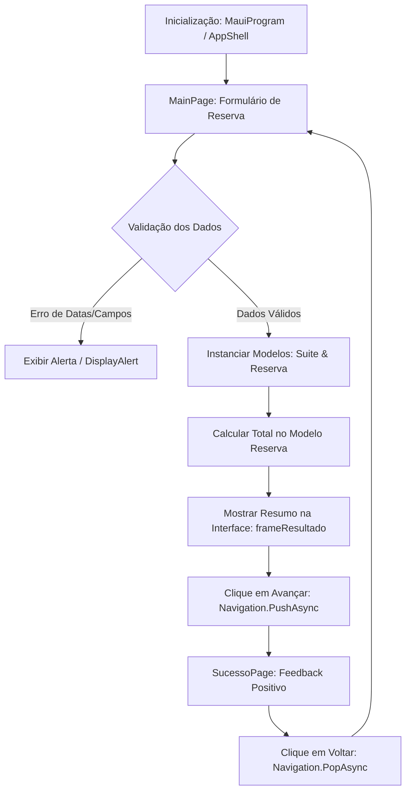
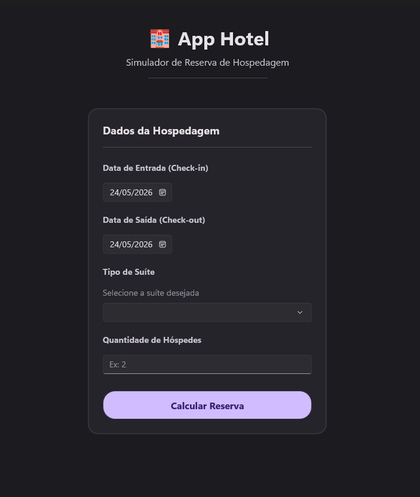
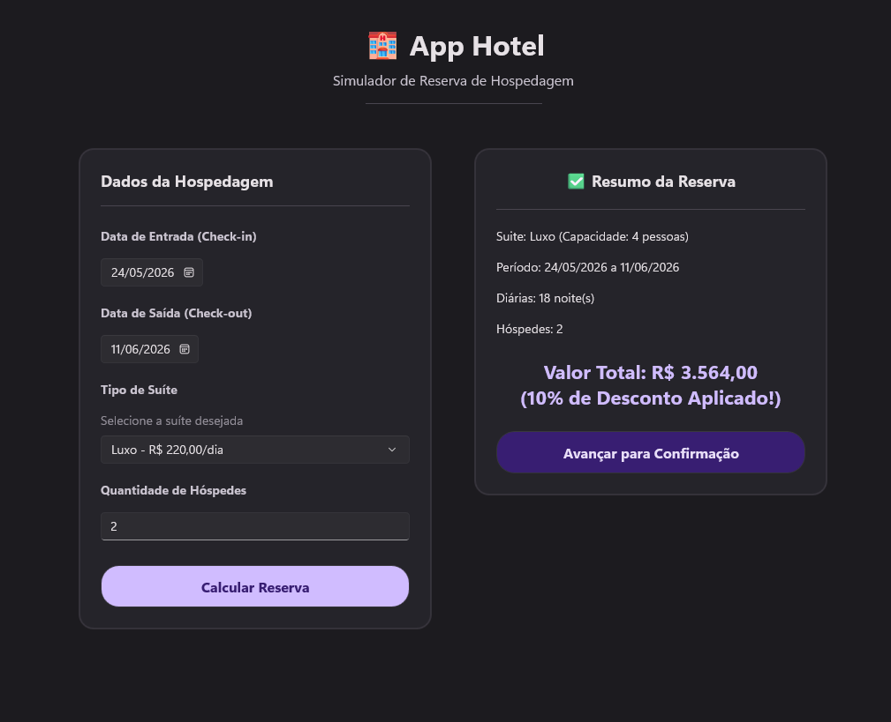

## 📋 O que é a Aplicação?

O **AppHotel** é um aplicativo mobile e desktop multiplataforma construído utilizando o framework moderno **.NET MAUI (Multi-platform App UI)**. Ele funciona como uma **calculadora e simuladora de reservas de hospedagem**, permitindo que o cliente insira o período de estadia desejado, selecione a categoria de suíte de sua preferência e defina a quantidade de hóspedes.

Com base nessas entradas, o app calcula de forma instantânea:
- A quantidade exata de noites/diárias reservadas.
- O valor unitário de cada diária conforme a suíte selecionada.
- O valor total acumulado para a estadia completa.

Após visualizar o resumo detalhado da simulação, o usuário pode prosseguir e receber uma confirmação visual de sucesso na reserva.

---

## ⚙️ Como a Aplicação Funciona? (Arquitetura e Fluxo)

Abaixo, descrevemos o fluxo de execução desde a inicialização do app até a confirmação da reserva:

### 1. Inicialização do Projeto (`MauiProgram.cs` e `App.xaml.cs`)
O ponto de partida do aplicativo é o método `CreateMauiApp()` em `MauiProgram.cs`. Ele é o responsável por inicializar o ciclo de vida do framework .NET MAUI, carregar os pacotes necessários, registrar as fontes personalizadas e inicializar a classe global do aplicativo `App.xaml.cs`. Esta última aponta a tela de inicialização para o contêiner `AppShell` (a "casca" do app).

### 2. Fluxo da Tela Principal (`MainPage.xaml` e `MainPage.xaml.cs`)
- **Entrada de Datas**: O usuário interage com dois controles `DatePicker` (`dpCheckIn` e `dpCheckOut`). No construtor da tela, limitamos a data mínima de ambos para a data do dia de hoje (`DateTime.Today`), o que impede o agendamento de reservas em datas retroativas.
- **Escolha do Quarto**: O usuário escolhe entre três categorias através de um controle `Picker` (`Standard`, `Luxo` ou `Premium`).
- **Quantidade de Clientes**: Uma caixa de texto `Entry` configurada com `Keyboard="Numeric"` restringe a digitação de textos facilitando o input do número de hóspedes.

### 3. Validação e Lógica de Negócio (`BtnCalcular_Clicked`)
Ao tocar em **"Calcular Reserva"**, o código executa as seguintes validações:
1. Garante que a data de checkout é estritamente posterior à data de check-in.
2. Certifica-se de que uma suíte foi realmente selecionada no Picker.
3. Valida se a quantidade de hóspedes é um número inteiro válido maior do que zero.

Após passar por todas as verificações, o programa define o preço unitário com base na suíte e cria as instâncias das classes do diretório **Models**:
- **`Suite`**: Representa a acomodação (Tipo, Capacidade, ValorDiaria).
- **`Hospede`**: Identidade do cliente (Nome, CPF, Email).
- **`Reserva`**: Centraliza os dados, expõe a propriedade calculada `DiasReservados` (calculada dinamicamente subtraindo as duas datas em formato `TimeSpan`) e executa o método `CalcularTotal()` (dias reservados multiplicados pelo valor da diária).

### 4. Apresentação do Resumo e Confirmação
Com o cálculo concluído, um painel visual (`Border x:Name="frameResultado"`) que estava invisível (`IsVisible="False"`) torna-se visível, expondo os dados calculados de forma legível e elegante ao usuário. Ao clicar em **"Avançar"**, o aplicativo navega programaticamente para a tela de confirmação (`SucessoPage`).

---

## 📸 Demonstração Visual (Screenshots da Aplicação)

Abaixo estão as capturas de tela reais da aplicação rodando e demonstrando seu comportamento responsivo e robusto:

### 1. Tela Inicial e Formulário de Dados
A interface inicial adota o tema **Material 3 Charcoal Dark** sóbrio e minimalista. As fontes têm excelente leitura e os campos estão alinhados. É possível notar o design limpo do seletor de datas e picker de suítes.

### 2. Lógica de Cálculo e Desconto em Ação
Ao preencher os dados de estadia e clicar em **"Calcular Reserva"**, o app abre o painel de resumo posicionado perfeitamente lado a lado com o formulário (no formato de duas colunas do computador). 
Neste exemplo, preenchemos uma reserva de 10 dias de Luxo. O sistema calculou o valor total e aplicou automaticamente a **regra de negócio de 10% de desconto** com a etiqueta amarela de sucesso em destaque!

### 3. Confirmação Final de Sucesso
Ao clicar em "Avançar", a navegação nativa do MAUI Shell realiza a transição para a página final de confirmação de sucesso, exibindo um feedback visual minimalista e limpo que confirma que a suíte está reservada.

---

## 🧠 Análise Técnica de um Desenvolvedor (Júnior/Pleno)

### 💪 Pontos Fortes da Aplicação
1. **Design Moderno e Atraente (Wow Factor)**: A escolha de uma paleta de cores Dark harmoniosa (tons de roxo escuro, lilás, botões roxos acesos e destaques em amarelo ouro) proporciona uma experiência premium e confortável aos olhos.
2. **Interface Fluida e Responsiva**: O uso de layouts inteligentes (`VerticalStackLayout` emparelhado com `ScrollView`) garante que a tela role perfeitamente e se ajuste a múltiplos tamanhos de dispositivos móveis.
3. **Validações Seguras Contra Quebras**: O app impede erros em tempo de execução ao forçar que datas retroativas fiquem desabilitadas nos seletores e ao usar `int.TryParse` para evitar quebras por caracteres na quantidade de hóspedes.
4. **Organização das Entidades (Orientação a Objetos)**: Separação correta dos conceitos de negócio. Hóspede, Suíte e Reserva são classes com responsabilidades bem definidas no diretório `Models`.
5. **Navegação Elegante e Segura**: Uso correto e nativo do padrão Shell da plataforma para transições de tela fluidas (`Shell.Current.GoToAsync(nameof(SucessoPage))` e `GoToAsync("..")`), evitando falhas de pilha de navegação.
6. **Lógica de Negócios e Regras de Validação Sólidas**: Implementação rigorosa do cálculo de descontos (10% para estadias de 10 ou mais dias), mapeamento dinâmico de capacidades (Standard=2, Luxo=4, Premium=6) e validação contra o número de hóspedes.

### ⚠️ Pontos a Melhorar (Próximos Passos de Arquitetura)
Como desenvolvedores, sempre pensamos em evolução de código. Aqui estão as oportunidades de melhoria de arquitetura que identificamos:
1. **Lógica de Preços "Chumbada" (Hardcoded)**: O preço da diária e a capacidade máxima ainda estão na estrutura switch no code-behind (`MainPage.xaml.cs`). O ideal seria que esses dados fossem carregados de uma fonte de dados externa ou banco de dados.
2. **Falta de Persistência ou Envio Real de Dados**: Ao avançar para a página de sucesso, os dados calculados não são gravados em um banco de dados local (como SQLite) nem enviados para uma API externa.
3. **Não Utilização do Padrão MVVM (Model-View-ViewModel)**: A lógica visual está acoplada no arquivo code-behind (`MainPage.xaml.cs`). A migração para MVVM facilitaria muito a testabilidade de software e separaria a lógica da interface do usuário.

*Documentação escrita por Valdan Conceição França*
